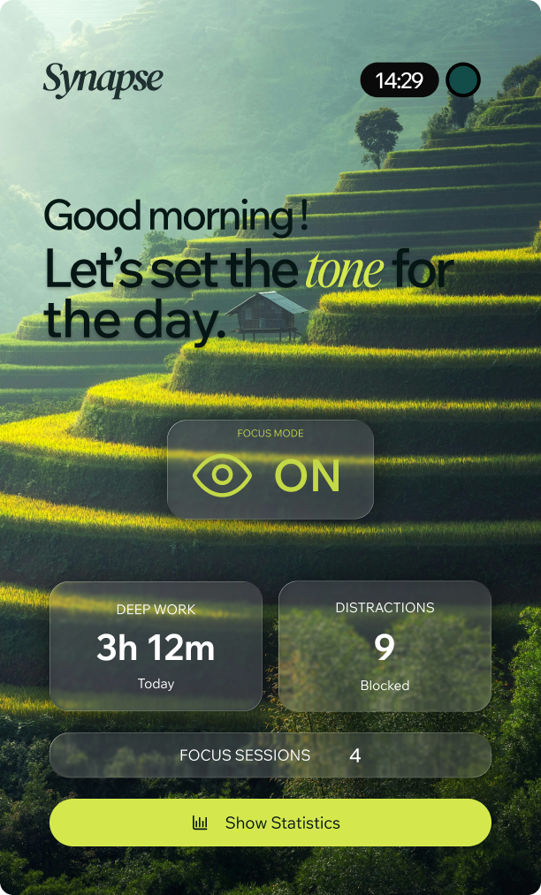
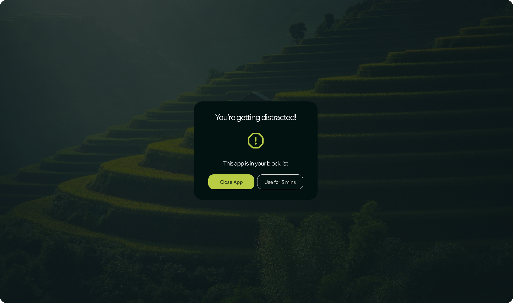
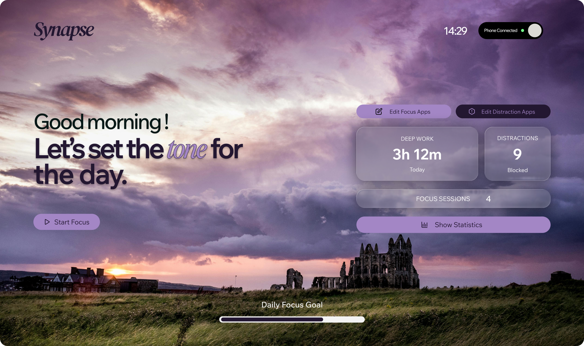

# Synapse - Intelligent Focus & Distraction Blocker

<div align="center">


**Let's set the tone for the day.**

A beautiful, cross-platform focus management application that helps you maintain deep work sessions while intelligently blocking distractions.

[](https://www.rust-lang.org/)
[](https://reactjs.org/)
[](https://tauri.app/)
[](LICENSE)

[Features](#-features) • [Screenshots](#-screenshots) • [Installation](#-installation) • [Theme System](#-theme-system) • [Architecture](#-architecture) • [Development](#-development)

</div>

---

## 🎯 Overview

Synapse is a sophisticated focus management tool built with Rust and React that monitors your active applications, blocks distractions, and helps you maintain productive deep work sessions. With its stunning glassmorphic UI and intelligent session tracking, Synapse makes staying focused both beautiful and effortless.

## ✨ Features

### 🎨 **Stunning Visual Design**
- **Glassmorphic UI** - Modern frosted glass effects with smooth backdrop blur
- **4 Beautiful Themes** - Switch between Green, Blue, Purple, and Black themes
- **Responsive Layout** - Seamless experience across desktop and mobile
- **Fluid Animations** - Smooth transitions, hover effects, and micro-interactions
- **Dynamic Typography** - Custom font stacks with precise letter spacing

### 🧠 **Intelligent Focus Management**
- **Smart Session Tracking** - Automatically starts/stops based on work app detection
- **Distraction Blocking** - Real-time popup warnings when blocked apps are opened
- **App Categorization** - Customizable whitelist/blacklist system via JSON
- **Deep Work Metrics** - Track daily progress toward focus goals
- **Session History** - Review past focus sessions and patterns

### 🔄 **Cross-Platform Sync**
- **Supabase Integration** - Cloud sync for sessions and metrics
- **Device Connectivity** - Phone sync with live connection status
- **Offline-First** - Works without internet, syncs when available
- **Real-time Updates** - Live session data across all devices

### 📊 **Comprehensive Analytics**
- Focus session duration tracking
- Distraction attempt counting
- Daily goal progress visualization
- App usage statistics and patterns

## 📸 Screenshots

### Main Dashboard - Green Theme

*Serene rice terraces background with vibrant lime accent*

### Focus Mode States
| Focus On | Focus Off | Distraction Alert |
|-----------|----------|-------------------|
|  |  |  |

### Theme Showcase
| Blue Theme | Purple Theme | Black Theme |
|------------|--------------|-------------|
|  |  |  |

### Device Sync & App Management

*Seamless device synchronization with OTP pairing*


*Easy-to-use focus and distraction app editors*

## 🎨 Theme System

Synapse features a sophisticated dynamic theme system that transforms the entire UI with beautiful, contextual backgrounds and harmonious color palettes.

### How Themes Work

The theme system uses CSS custom properties (variables) that are dynamically loaded from JSON configuration files:

```javascript
// ui/src/theme-loader.js
export async function applyTheme(name) {
  const res = await fetch(`../../themes/theme-${name}.json`);
  const theme = await res.json();
  const root = document.documentElement;
  
  Object.entries(theme).forEach(([key, val]) => {
    root.style.setProperty(`--${key}`, val);
  });
}
```

### Available Themes

#### 🌿 **Green - Rice Terraces**
```json
{
  "primarycolor": "73 85% 60%",
  "secondarycolor": "172 64% 6%",
  "synapse-bg-image": "url('/images/rice-terraces-bg.jpg')"
}
```
**Mood:** Calm, Natural, Growth-focused
- Vibrant lime accent (#D4E84D)
- Deep forest green base
- Serene Vietnamese rice terraces backdrop

#### 🌊 **Blue - Mountain Vista**
```json
{
  "primarycolor": "216.9 86.7% 8.8%",
  "secondarycolor": "19.2 90.0% 84.3%",
  "synapse-bg-image": "url('/images/mountain.jpg')"
}
```
**Mood:** Professional, Focused, Calm
- Deep navy blue base
- Warm peach accent
- Majestic mountain landscape

#### 💜 **Purple - Abbey Ruins**
```json
{
  "primarycolor": "270 33% 65%",
  "secondarycolor": "270 35% 14%",
  "synapse-bg-image": "url('/images/purple-town-bg.jpg')"
}
```
**Mood:** Creative, Mysterious, Contemplative
- Soft lavender accent
- Rich deep purple base
- Historic abbey at sunset

#### ⚫ **Black - Night Drive**
```json
{
  "primarycolor": "0.0 0.0% 15.3%",
  "secondarycolor": "0.0 0.0% 90%",
  "synapse-bg-image": "url('/images/night-car.jpg')"
}
```
**Mood:** Sleek, Modern, High-contrast
- Pure monochrome palette
- Dramatic night photography
- Maximum contrast for late-night work

### Theme Switching

Themes can be switched dynamically without page reload:

```javascript
// Change theme
await applyTheme('blue');  // or 'green', 'purple', 'black'
```

### UI/UX Design Principles

#### **Glassmorphism**
All cards and UI elements use sophisticated glassmorphic effects:
```css
.glass-card {
  background: rgba(255, 255, 255, 0.12);
  backdrop-filter: blur(24px);
  border: 1px solid rgba(255, 255, 255, 0.18);
  box-shadow: 0 8px 32px rgba(0, 0, 0, 0.37);
}
```

#### **Typography Hierarchy**
- **Hero Text:** Tight letter-spacing (-7%) for impact
- **Body Text:** Subtle spacing (-1%) for readability
- **Custom Fonts:** 
  - Instrument Serif (italic accents)
  - DM Serif Text (headers)
  - Wix Madefor Text (body)

#### **Interactive States**
Every interactive element includes:
- Smooth hover transformations
- Scale animations (1.02-1.1x)
- Glow effects on accent elements
- Subtle lift shadows

#### **Micro-interactions**
- **Pulse Animation:** Phone connection indicator
- **Shimmer Effect:** Loading states on cards
- **Rotation:** Icon rotations on hover
- **Progress Animations:** Smooth bar fills

#### **Responsive Design**
- Mobile-first approach
- Fluid typography (clamp values)
- Adaptive grid layouts
- Touch-optimized hit areas

## 🚀 Installation

### Prerequisites

- **Rust** 1.77.2 or higher
- **Node.js** 18+ and npm
- **Tauri CLI** 2.7+

### Quick Start

1. **Clone the repository**
```bash
git clone https://github.com/Utsavvv1/synapse-revamped.git
cd synapse
```

2. **Install dependencies**
```bash
# Install Rust dependencies
cd main-logic
cargo build

# Install UI dependencies
cd ../ui
npm install
```

3. **Set up environment variables**
```bash
# Copy example env file
cd ../main-logic
cp .env.example .env

# Add your Supabase credentials (optional)
SUPABASE_API_KEY=your_key_here
SUPABASE_URL=your_url_here
```

4. **Configure app rules**
```bash
# Edit apprules.json to customize your focus/distraction apps
cd main-logic
nano apprules.json
```

```json
{
  "whitelist": ["notepad", "vscode", "slack"],
  "blacklist": ["chrome", "discord", "spotify"]
}
```

5. **Run the application**
```bash
# Development mode
npm --prefix ui run dev

# Build for production
npm run tauri build
```

## 🏗️ Architecture

### Project Structure

```
synapse-revamped/
├── main-logic/                 # Rust backend
│   ├── src/
│   │   ├── main.rs            # Entry point
│   │   ├── session.rs         # Session management
│   │   ├── apprules.rs        # App filtering logic
│   │   ├── db.rs              # SQLite database
│   │   ├── sync.rs            # Supabase sync
│   │   ├── platform/          # OS-specific code
│   │   │   ├── windows.rs
│   │   │   └── linux.rs
│   │   └── logger.rs          # Event logging
│   ├── apprules.json          # App whitelist/blacklist
│   └── synapse_metrics.db     # Local database
│
├── src-tauri/                 # Tauri configuration
│   ├── src/lib.rs
│   └── tauri.conf.json
│
└── ui/                        # React frontend
    ├── src/
    │   ├── components/        # UI components
    │   ├── layouts/           # Layout components
    │   ├── pages/             # Page components
    │   ├── styles/            # Global styles
    │   ├── theme-loader.js    # Dynamic theme loader
    │   └── main.tsx           # React entry
    ├── public/
    │   ├── themes/            # Theme JSON files
    │   └── images/            # Background images
    └── tailwind.config.js     # Tailwind configuration
```

### Technology Stack

**Backend:**
- **Rust** - High-performance system monitoring
- **SQLite** - Local session storage
- **Tokio** - Async runtime
- **Serde** - Serialization

**Frontend:**
- **React 19** - UI framework
- **TypeScript** - Type safety
- **Tailwind CSS** - Utility-first styling
- **Vite** - Build tool

**Desktop:**
- **Tauri 2.7** - Native wrapper
- **Cross-platform** - Windows & Linux support

**Sync:**
- **Supabase** - Cloud database
- **Real-time subscriptions** - Live updates

### Data Flow

```
┌─────────────┐
│   OS Layer  │ ← Platform-specific APIs
└──────┬──────┘
       │
┌──────▼──────────┐
│  Session Mgr    │ ← Rust core logic
│  - Track apps   │
│  - Block dist.  │
│  - Log events   │
└──────┬──────────┘
       │
┌──────▼──────────┐
│  Local SQLite   │ ← Persistent storage
└──────┬──────────┘
       │
┌──────▼──────────┐
│  Supabase Sync  │ ← Cloud backup
└──────┬──────────┘
       │
┌──────▼──────────┐
│  React UI       │ ← User interface
│  - Dashboard    │
│  - Statistics   │
│  - Settings     │
└─────────────────┘
```

## 🛠️ Development

### Running Tests

```bash
# Run Rust tests
cd main-logic
cargo test

# Run integration tests
cargo test --test integration
```

### Database Schema

```sql
-- Focus Sessions
CREATE TABLE focus_sessions (
    id TEXT PRIMARY KEY,
    start_time INTEGER NOT NULL,
    end_time INTEGER,
    work_apps TEXT,
    distraction_attempts INTEGER
);

-- App Usage Events
CREATE TABLE app_usage_events (
    id TEXT PRIMARY KEY,
    process_name TEXT NOT NULL,
    status TEXT NOT NULL,
    session_id TEXT,
    start_time INTEGER,
    end_time INTEGER,
    duration_secs INTEGER,
    FOREIGN KEY(session_id) REFERENCES focus_sessions(id)
);
```

### Adding a New Theme

1. Create theme JSON in `ui/public/themes/`:
```json
{
  "primarycolor": "HSL values",
  "secondarycolor": "HSL values",
  "synapse-bg-image": "url('/images/your-image.jpg')"
}
```

2. Add background image to `ui/public/images/`

3. Update theme loader in `ui/src/theme-loader.js`

### Custom Styling

The project uses a custom design token system via CSS variables:

```css
:root {
  --synapse-dark: hsl(var(--secondarycolor));
  --synapse-accent: hsl(var(--primarycolor));
  --synapse-glass: rgba(255, 255, 255, 0.12);
}
```

<div align="center">

**Made with ❤️ and ⚡ by the Synapse Team**

*Let's set the tone for productive days ahead.*

</div>